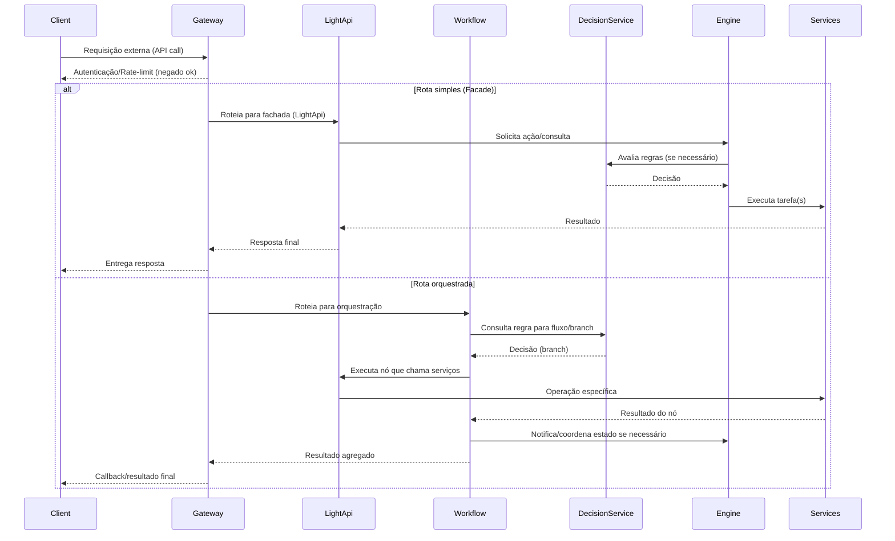

# Fluxo de Integração entre Modos

Descrição concisa do fluxo de integração entre `Gateway`, `LightApi`, `Workflow` e `BRMS` (`decision-service`). O diagrama abaixo mostra os caminhos principais (faça zoom para o cenário desejado: fachada simples vs orquestração).



Passos (resumido):
1. Cliente faz requisição ao `Gateway` (autenticação, quotas, roteamento por tenant/rota).
2. `Gateway` decide roteamento: `LightApi` (fachada/síncrono) ou `Workflow` (orquestração/assincrônico).
3. Em chamadas síncronas a `LightApi`, o fluxo pode delegar ao `Engine` e consultar o `BRMS` para decisões em tempo de execução.
4. Em orquestração, `Workflow` coordena nós; cada nó pode consultar `BRMS` e chamar `LightApi`/serviços especializados.
5. Todos os passos devem instrumentar métricas, logs e tracing (IDs de correlação propagados pelo `Gateway`).

Boas práticas e recomendações:
- Propague `correlation_id` desde o `Gateway` para rastreabilidade em logs/traces.
- Use timeouts curtos e retries exponenciais entre serviços; torne ações idempotentes quando possível.
- Externalize políticas de decisão no `BRMS` para permitir mudanças sem deploy.
- Monitore SLAs por fluxo no Grafana e crie alertas para falhas e latências.
- Defina contratos (OpenAPI) para `LightApi` e nodes do `Workflow` para evitar regressões.

Exemplo rápido (pseudopayload):

Request (Client → Gateway):
```
POST /api/purchase
{
  "user_id": "u-123",
  "cart": [...],
  "correlation_id": "cid-0001"
}
```

Workflow node (consulta BRMS):
```
GET /decision/price-rule?tenant=acme&cart=...
```

Observability:
- Traces iniciados no `Gateway` (attach span) e propagados em chamadas downstream.
- Métricas por fluxo: latency_p95, success_rate, error_count, retries.

---

Se quiser, eu gero uma versão visual maior (PNG/SVG) do diagrama mermaid, um slide com passo a passo, ou adapto o fluxo para um caso de uso específico (ex.: checkout). Diga qual prefere.
