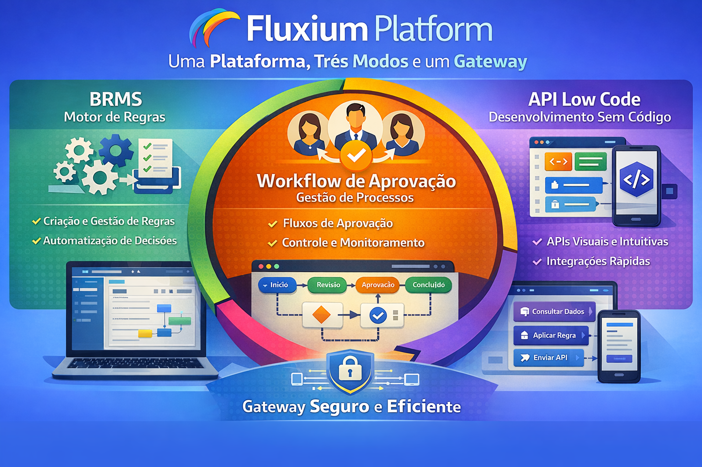
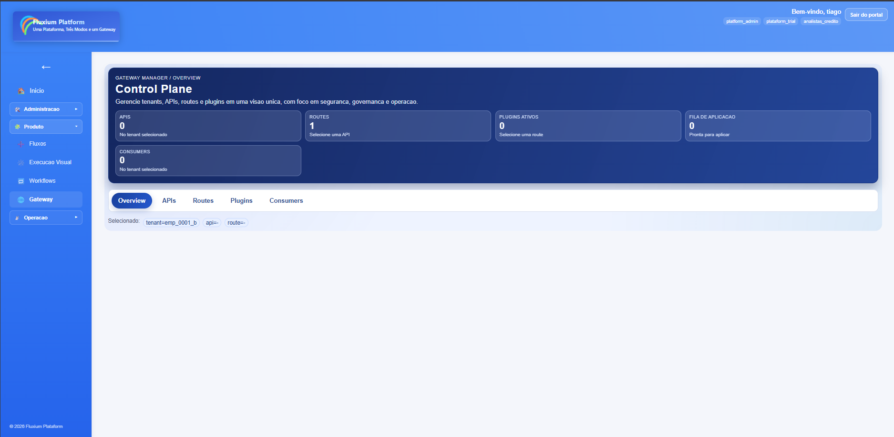
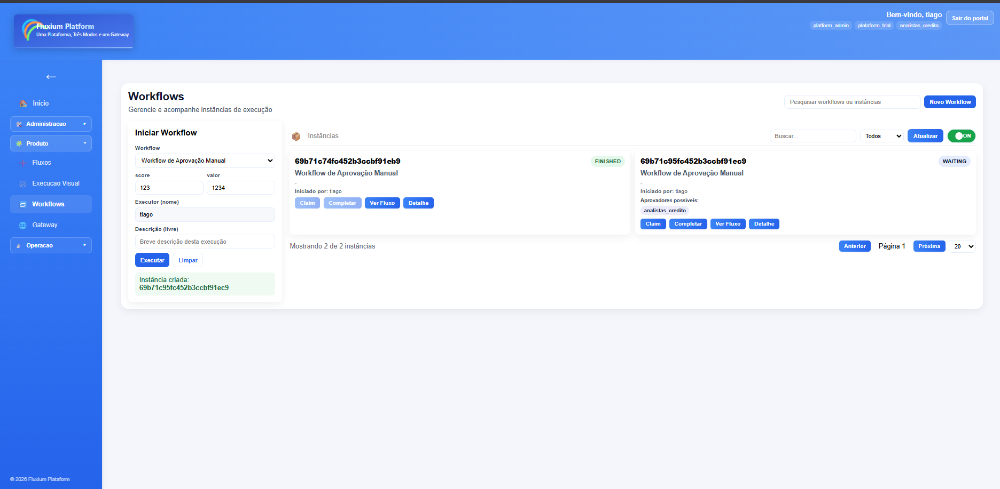
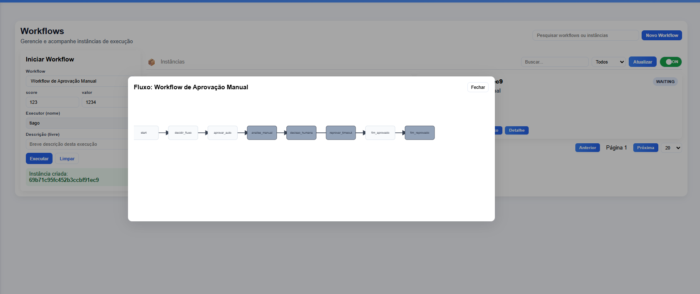
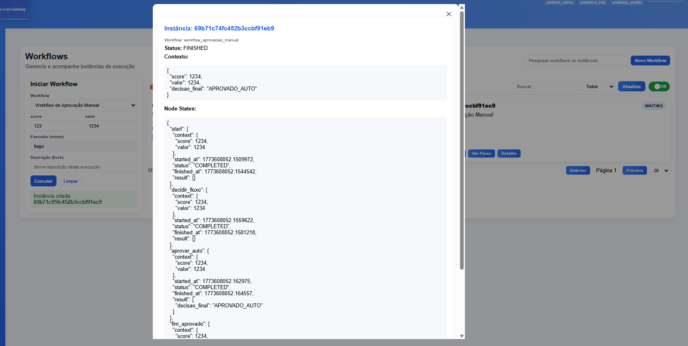

# Fluxium — Proposta Comercial

## Pitch Rápido
Fluxium é uma plataforma modular de orquestração de fluxos de negócio que acelera integrações, reduz custos operacionais e aumenta a velocidade de entrega de produtos digitais. Fornecemos um gateway extensível, um motor de workflows e serviços desacoplados prontos para produção, com observabilidade e deploy facilitados.

## Benefícios Principais
- **Time-to-market reduzido:** templates e serviços prontos aceleram integração de novos fluxos.
- **Governança centralizada:** controles, políticas e plugins no gateway garantem segurança e conformidade.
- **Escalabilidade:** arquitetura microserviços e suporte a orquestradores (Docker Compose → Kubernetes).
- **Observabilidade integrada:** métricas, logs e tracing prontos via Prometheus/Grafana/Loki/Tempo.
- **Custo operacional otimizado:** serviços leves e reutilizáveis reduzem esforço de manutenção.

## Para quem é útil
- Equipes de engenharia que precisam orquestrar múltiplos serviços e regras de negócio.
- Times de produto que querem lançar features rápidas com integração de terceiros.
- Operações/DevOps que precisam de transparência e controle sobre tráfego, SLAs e deploys.

## Principais Casos de Uso
- Orquestração de checkout e catálogo (integração com ERPs, gateways de pagamento).
- Automação de processos administrativos entre workspaces e multi-tenant.
- Implementação de políticas de segurança e rate-limiting centralizadas.
- Fluxos de decisão com `decision-service` integrados ao motor de workflows.

## Diferenciais Competitivos
- Gateway extensível por plugins prontos (autenticação, caching, forwarding, circuit-breaker).
- Motor de workflows desacoplado permite criar e reutilizar grafos de negócio.
- Estrutura de deploy já alinhada com observabilidade e práticas DevOps.

## Modos de Operação — Tópicos

### BRMS (Business Rules Management System)
- Objetivo: centralizar regras de negócio e decisões reutilizáveis.
- Benefícios: separação entre lógica de decisão e fluxo de execução; facilidade para alterar políticas sem deploys completos; auditoria e versionamento de regras.
- Quando usar: regras complexas de precificação, políticas de aprovação, validações condicionais que mudam com frequência.
- Integração: expõe endpoints para avaliação de regras e pode ser consultado pelo `fluxium-engine` ou diretamente por serviços via `decision-service`.

### Workflow
- Objetivo: orquestrar passos e grafos de negócio de forma declarativa.
- Benefícios: coordenação de tarefas distribuídas; reuso de grafos; supervisão de estados e retomada de execuções.
- Quando usar: processos longos, compensações, integração de múltiplos serviços (ERP, CRM, pagamentos).
- Integração: `workflow-service` executa e coordena os nós, integrando com BRMS e LightApi quando necessário.

### LightApi
- Objetivo: fornecer uma fachada leve para integrações externas e consumo simples de serviços internos.
- Benefícios: endpoints otimizados para integrações, menos overhead, camadas de segurança e transformação embutidas.
- Quando usar: integrações de terceiros, gateways BFF simples, ou quando é necessária uma rota rápida para dados/processos sem orquestração pesada.
- Integração: funciona como facade; pode encaminhar chamadas para `fluxium-engine`, `decision-service` ou serviços especializados.

### Gateway
- Objetivo: ponto central de entrada para tráfego externo com políticas, plugins e roteamento.
- Benefícios: controle de acesso, rate-limiting, caching, circuit-breaker e extensibilidade por plugins.
- Quando usar: toda exposição pública de APIs, políticas de segurança e roteamento entre ambientes/tenants.
- Integração: atua como proxy central, aplicando políticas antes de encaminhar para `LightApi`, `fluxium-admin`, `workflow-service` ou outros serviços.

## Imagens

- Modos de operação:

- Exemplos e screenshots:

Referência completa do fluxo e recomendações de instrumentação estão em `INTEGRATION_FLOW.md`.

<!-- ## Oferta de Entrega (exemplo)
1. Kickoff e levantamento (1 semana)
2. PoC com 1 fluxo end-to-end (2–3 semanas)
3. Hardening, observability e testes (1 semana)
4. Entrega e documentação operadora (1 semana) -->

<!-- ## Métricas de Sucesso
- Tempo para integrar novo serviço (target: ≤ 1 semana)
- Disponibilidade do fluxo crítico (target: 99.9%)
- Redução de chamadas redundantes via caching (meta: -30%)

## Next Steps / Call To Action
- Agendar demo técnica com apresentação do fluxo end-to-end.
- Preparar PoC com um caso real do cliente para validar ROI. -->